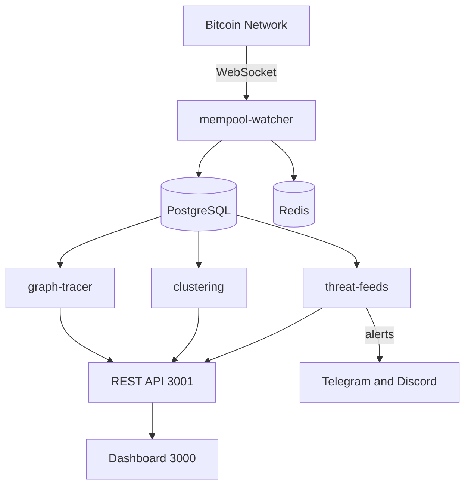
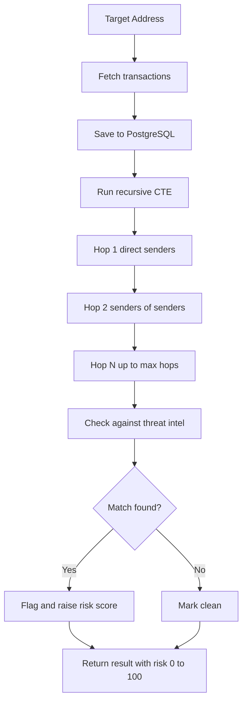
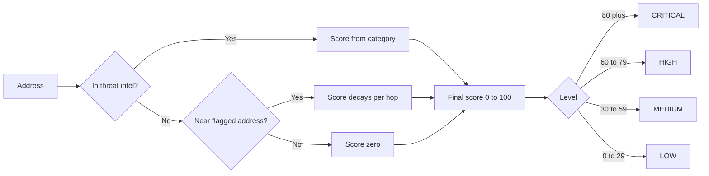
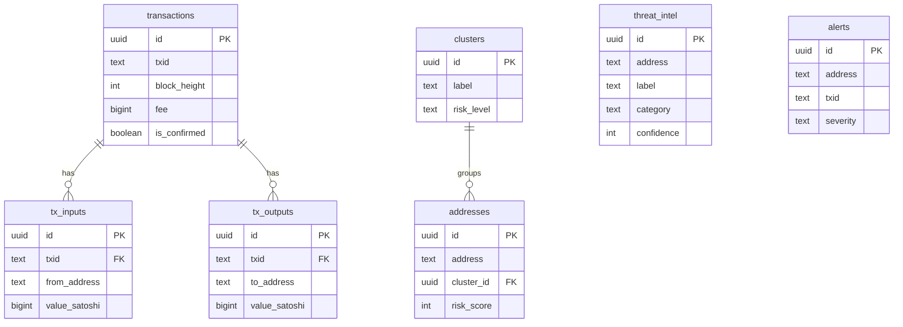

# ChainTrail

> Open Source Bitcoin AML Forensics and Transaction Trail Tracker

[


](LICENSE)
[


](https://nodejs.org)
[


](https://typescriptlang.org)
[


](https://postgresql.org)

ChainTrail is a real-time Bitcoin transaction monitoring and AML forensics platform. It streams every live Bitcoin transaction, traces fund flows across the blockchain graph, clusters related addresses, and flags known bad actors.

---

## Architecture



---

## Graph Tracer Flow



---

## Risk Scoring



---

## Database Schema



---

## Features

| Feature | Description |
|---------|-------------|
| Live Mempool Stream | WebSocket to mempool.space every Bitcoin tx pushed instantly |
| Graph Tracer | Trace fund flows N hops deep using PostgreSQL recursive CTEs |
| Address Clustering | Group related addresses using Union-Find heuristic |
| Risk Scoring | Score addresses 0 to 100 based on proximity to bad actors |
| Threat Intel | 1258 plus known bad actors including WannaCry and Lazarus Group |
| Webhook Alerts | Telegram and Discord alerts when watched addresses hit mempool |
| Mobile Dashboard | Responsive Next.js UI works on Android |
| REST API | 14 endpoints for programmatic access |

---

## Project Structure

```
chaintail/
├── packages/
│   ├── node-connector      Bitcoin RPC and Blockstream API
│   ├── mempool-watcher     Live WebSocket stream
│   ├── graph-tracer        Recursive graph traversal
│   ├── clustering          Union-Find clustering engine
│   ├── threat-feeds        Threat intel and webhooks
│   ├── api                 Express REST API
│   ├── shared              Types and DB schema
│   └── dashboard           Next.js UI
└── package.json
```

---

## Quick Start

Prerequisites: Node.js 18 plus, PostgreSQL 14 plus, Redis 6 plus

```bash
git clone https://github.com/rajeshselvam02/chaintail.git
cd chaintail
npm install --legacy-peer-deps
cp .env.example .env
```

```bash
psql -U postgres -c "CREATE USER chaintail WITH PASSWORD chaintail;"
psql -U postgres -c "CREATE DATABASE chaintail OWNER chaintail;"
npm run migrate
cd packages/threat-feeds && npm run sync
```

```bash
cd packages/api && npm run dev
cd packages/mempool-watcher && npm run dev
cd packages/dashboard && npm run dev
```

Open http://localhost:3000

---

## API Reference

Base URL: http://localhost:3001

| Method | Endpoint | Description |
|--------|----------|-------------|
| GET | /api/health | Health check |
| GET | /api/address/:address | Address info and risk score |
| GET | /api/trace/:address | Trace fund flow |
| POST | /api/trace | Trace with options |
| GET | /api/cluster/:address | Get address cluster |
| POST | /api/cluster/run | Run clustering |
| GET | /api/alerts | List alerts |
| GET | /api/mempool/stats | Mempool statistics |
| GET | /api/mempool/recent | Recent transactions |
| GET | /api/threat-intel | List threat intel |
| POST | /api/threat-intel | Add threat intel |
| GET | /api/webhooks/watched | Watched addresses |
| POST | /api/webhooks/watched | Watch an address |

---

## Threat Intelligence

| Source | Category | Count |
|--------|----------|-------|
| WannaCry ransomware | Ransomware | 3 |
| Lazarus Group | Sanctioned | 1 |
| Silk Road | Darknet | 1 |
| BitcoinFog and Helix | Mixer | 2 |
| CryptoScamDB | Scam | 1163 |
| Public mixer lists | Mixer | 85 |
| Total | All | 1258 plus |

---

## Android Support

```bash
pkg install proot-distro
proot-distro install ubuntu
proot-distro login ubuntu
apt install nodejs postgresql redis-server git -y
```

Then follow the standard installation steps above.

---

## Roadmap

- [x] Live WebSocket mempool stream
- [x] N-hop recursive graph tracer
- [x] Address clustering
- [x] Threat intel sync
- [x] REST API
- [x] Mobile dashboard
- [x] Webhook alerts
- [ ] D3.js graph visualization
- [ ] OFAC sanctions auto-sync
- [ ] Docker compose
- [ ] Lightning Network support
- [ ] Ethereum support

---

## License

MIT - Built by [@rajeshselvam02](https://github.com/rajeshselvam02)
